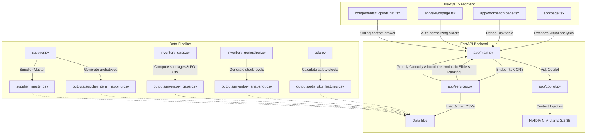

# Procurement Intelligence Platform - Decision Support Hub

An AI-powered decision support system designed to help procurement managers view inventory risks, review shortages, dynamically adjust supplier priorities, optimize purchase order allocations, and query decisions via an explanatory AI Copilot.

---

## Architecture Overview

The system is split into three main layers: **Data Generation & Modeling**, **FastAPI Backend Services**, and **Next.js 15 Visual Client**.



---

## 1. Data & Modelling Pipeline (End-to-End)

The data pipeline runs sequentially to build features, train machine learning models for demand forecasting, calculate safety stock, simulate inventories, evaluate risks, and map supplier profiles.

### Step 1: Exploratory Data Analysis, Safety Stock, & Demand Forecasting (`eda.py`)
- **EDA & Priority Profiling**:
  - Analyzes historical sales logs over 730 days to extract average daily demand, volatility, and frequency.
  - Classifies all SKUs into priority classes:
    - **ABC Class**: Revenue contribution classification (Class A represents the top 80% revenue).
    - **XYZ Class**: Volatility classification (Class X has low volatility; Class Z has high volatility).
  - Computes **Safety Stock** and **Reorder Points (ROP)** using statistical formulas at a 95% service level.
  - Outputs structural features to `outputs/eda_sku_features.csv`.
- **Machine Learning Demand Forecasting**:
  - **Model Choice**: A single **Global LightGBM Regressor** is trained simultaneously on all 400 SKUs. Using a single global model helps transfer demand patterns across similar SKUs, outperforming separate classical time-series models (like ARIMA/SARIMA) on sparse/low-demand items.
  - **Objective Function**: Configured with a **Tweedie objective** (variance power: 1.5) to model zero-inflated, intermittent demand patterns where sales are frequently zero but positive when they occur.
  - **Features Engineered**:
    - **Lags**: Direct lagged sales for `[1, 2, 3, 7, 14, 28]` days.
    - **Rolling Means & Volatilities**: Trailing averages and standard deviations over windows of `[7, 14, 28, 90, 180]` days.
    - **Non-zero rolling means**: Average demand specifically on active sales days (`90` and `180` days) to capture the magnitude of purchase events.
    - **Sparsity Indicators**: Active sales frequencies and non-zero counts in trailing 28 and 90-day windows.
    - **Recency Metrics**: Days since last sale (measures recency of demand, crucial for intermittent/lumpy SKUs).
    - **Calendar Features**: Day-of-week, month index, promotional/special event indicators (`is_event`), and SNAP calendar flags (`is_snap`).
    - **Categorical Encodings**: Encodings of SKU metadata (ABC class, XYZ class, Velocity, and Demand pattern).
  - **Validation & Metrics**:
    - Evaluated on a **30-day out-of-time validation split** using custom metrics: **RMSE**, **MAE**, and demand-weighted **WMAPE** (Weighted Mean Absolute Percentage Error) as the headline metric to penalize errors on high-demand days more heavily.
  - **Outputs Generated**:
    - `outputs/forecast_7_days.csv`: 7-day ahead recursive demand forecasts per SKU.
    - `outputs/forecast_30_days.csv`: 30-day ahead recursive demand forecasts per SKU.
    - `outputs/forecast_plots/`: Visualizations including Feature Importance, RMSE distributions, and sample forecasts for different SKU classes.

### Step 2: Inventory Snapshot Generation (`inventory_generation.py`)
- Simulates current stock levels for each SKU, creating synthetic available inventory counts.
- Outputs stock levels to `outputs/inventory_snapshot.csv`.

### Step 3: Gaps & Shortage Computations (`inventory_gaps.py`)
- Integrates the 7-day and 30-day demand forecasts with the current inventory snapshot and safety stock requirements.
- Calculates:
  - **Gaps**: `forecast + safety_stock - available_inventory`
  - **Shortage Quantity**: `gap_30d` clipped to 0
  - **Days Until Stockout**: `available_inventory / daily_forecast_rate`
  - **Inventory Risk Score**: Weighted sum of gap ratios, ABC classifications, XYZ classes, and demand risk.
  - **Procurement Trigger**: Action flag set to `YES` if stockout is projected within 21 days or risk is Critical.
  - **Recommended PO Quantity**: `shortage_quantity + 25% of 30-day forecast` (for buffer stock).
- Outputs features to `outputs/inventory_gaps.csv`.

### Step 4: Supplier Matching & Profiles (`supplier.py`)
- Creates 12 suppliers mapped across 5 archetypes:
  - **Strategic**: High cost, high reliability (90-99%), low risk (5-15), 10,000 capacity.
  - **Balanced**: Average cost, moderate reliability (80-91%), 7,000 capacity.
  - **Cost**: Low cost, low reliability (65-86%), 12,000 capacity.
  - **Emergency**: Extremely high cost, fast lead times (1-5 days), 3,000 capacity.
  - **Regional**: Moderate parameters, 5,000 capacity.
- Maps each SKU to 4 candidate suppliers in `outputs/supplier_item_mapping.csv` with simulated SKU-specific prices based on cost factor.
- Realistic supplier names are updated globally via `generate/update_supplier.py` into the root `supplier_master.csv`.

---

## 2. FastAPI Backend Services

Exposes REST APIs to decouple pandas calculations and AI chat from the frontend visual layout.

### APIs Reference

#### 1. `GET /dashboard`
- Returns executive metrics (Total SKUs, Alerts, Triggers, Emergency orders count, shortage sum, recommended PO qty).
- Returns distribution datasets for Recharts charts (Priority, Category, Department groups, and Top 10 shortage items).

#### 2. `GET /procurement-items`
- Query parameters: `priority`, `category`, `department`, `search`.
- Returns search-filtered rows containing shortage quantities, priorities, and triggers for the workbench table.

#### 3. `GET /sku/{item_id}`
- Returns SKU inventory metrics, forecasts, days until stockout, risk logs, and lists candidate suppliers mapped to the SKU.

#### 4. `POST /rank-suppliers`
- Request payload: `item_id`, `cost_weight`, `lead_time_weight`, `reliability_weight`, `quality_weight`, `risk_weight`.
- Mathematically normalizes the slider weights to sum to 100%.
- Calculates individual criteria scores relative to the local candidate pool:
  - Cost Score (lower price is better): `(max_price - price) / (max_price - min_price) * 100`
  - Lead Time Score (lower time is better): `(max_lt - lead_time) / (max_lt - min_lt) * 100`
  - Reliability & Quality Score: Raw values (0-100)
  - Risk Score (lower raw risk is better): `100 - risk_score`
- Returns a ranked list of candidate suppliers.

#### 5. `POST /optimize-procurement`
- Request payload: `item_id`, `recommended_po_qty`, and the weights.
- Runs the deterministic ranking first.
- Allocates quantity greedily starting from the #1 ranked supplier up to their `capacity_units`.
- Returns allocation lists, percentage splits, spends, estimated total cost, and unallocated quantity.

#### 6. `POST /copilot`
- Request payload: `message`, `history` (list of roles/messages), `item_id` (context).
- Pulls target SKU details and supplier scores to inject as context.
- Prompts **NVIDIA NIM API** (`meta/llama-3.2-3b-instruct` or other SLM) to convert structured metrics into professional procurement explanations.
- Activates a smart rule-based mock advisor fallback if no API key is set.

---

## 3. Frontend Next.js 15 Client

Responsive, high-fidelity dark dashboard (`#080C14`) utilizing Outfit font typography, glassmorphism containers, and glowing panels.

- **Executive Dashboard (`/`)**: Shows KPI cards and four interactive charts:
  - Priority ring donut chart.
  - Category column chart.
  - Horizontal departments bars.
  - Top 10 shortages bar chart. Clicking on a bar navigates directly to the SKU detail page.
- **Procurement Workbench (`/workbench`)**: Densely populated list table featuring risk colors and search/dropdown filtering.
- **SKU Details (`/sku/[id]`)**: Page showing inventory metrics and containing:
  - **Dynamic weights sliders**: Whenever a weight is modified, the remaining weights adjust proportionally on the fly to maintain a constant 100% total sum. Modifying sliders immediately triggers uvicorn fetch events to re-rank suppliers and re-calculate PO quantity splits.
- **AI Copilot chat window**: Fixed floating toggle badge that opens a sliding side-drawer chat. Auto-tracks the active SKU ID context as you navigate through different SKU detail pages.

---

## 4. Setup & Running Instructions

Ensure Node.js (>= 18) and Python (>= 3.10) are installed.

### Step 1: Clone and Environment Variables
Make sure you have an `.env` file in the `sprint 2` root folder with your NVIDIA API key:
```env
NVIDIA_API_KEY="your-nvapi-key"
```

### Step 2: Install and Run FastAPI Backend
1. Open a terminal and navigate to the backend directory:
   ```bash
   cd backend
   pip install -r requirements.txt
   ```
2. Navigate to the `app` folder and launch uvicorn:
   ```bash
   cd app
   uvicorn main:app --reload --port 8000
   ```
   The backend will be running at `http://127.0.0.1:8000`.

### Step 3: Install and Run Next.js Frontend
1. Open a **new terminal window** and navigate to the frontend directory:
   ```bash
   cd frontend
   npm install
   ```
2. Start the development server:
   ```bash
   npm run dev -- --port 3000
   ```
3. Open your browser and navigate to `http://localhost:3000`.
